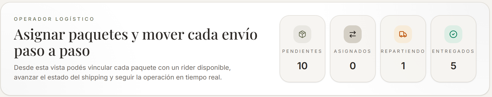
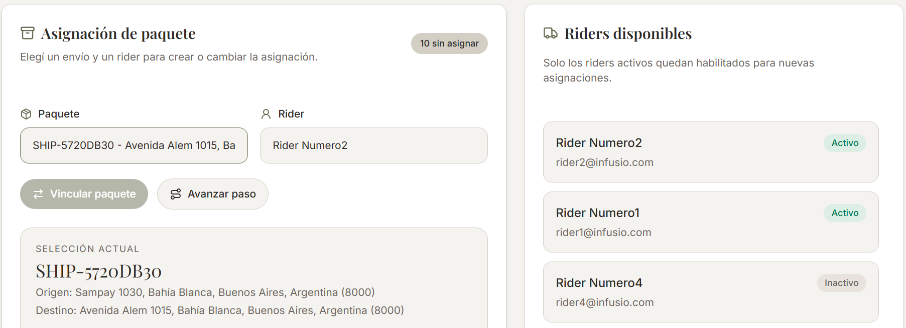

# Operador Logístico

Se encarga de monitorear los paquetes, actualizar su estado, ver los repartidores (y si están o no disponibles) y vincular los paquetes a un repartidor.

---

---

Para actualizar el estado de un paquete, se elige uno de los paquetes del menú desplegable y se selecciona "avanzar paso". Una vez que el envío llega a la ciudad de destino, se habilita el botón "vincular paquete" y, al clickearlo, se lo vincula con el rider seleccionado.