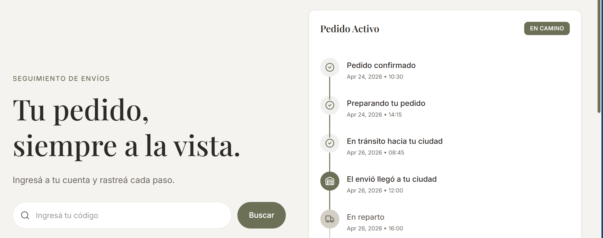
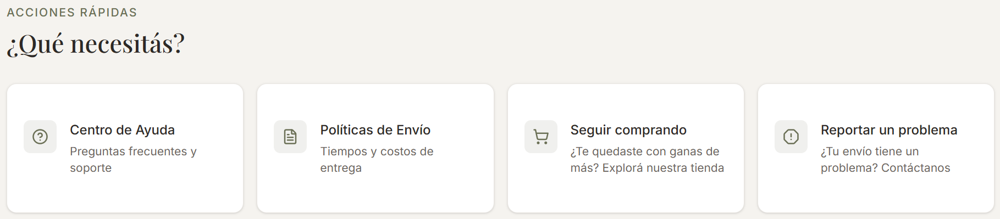
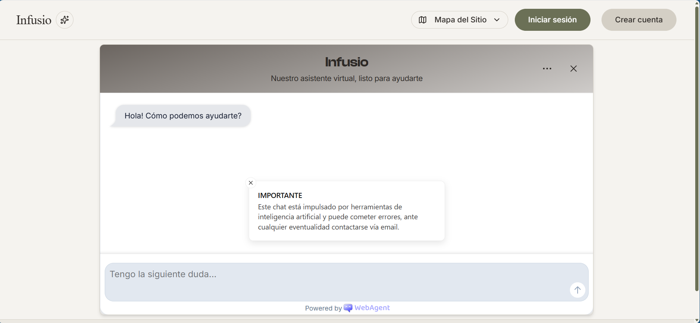
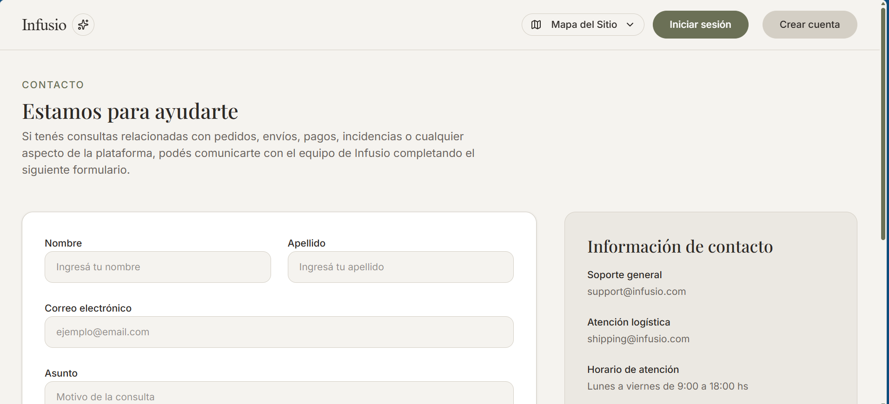

# Usuario no autenticado

Sin iniciar sesión, un usuario puede realizar varias operaciones. Todo usuario autenticado puede realizarlas también.

---
### Seguimiento de envío

Input de texto que redirecciona a una página con las actualizaciones del envío ingresado con el formato de la imagen. En caso de que el envío se encuentre en reparto en la misma ciudad, puede optar por hacer seguimiento en tiempo real (requiere que tanto el usuario como el repartidor tengan abierta la aplicación en simultáneo).

---
### Acciones

Un usuario no autenticado tiene acceso a la botonera con 4 acciones posibles:
- Centro de ayuda. Un chat impulsado por IA, provisto por WebAgent.

- Políticas de envío. Página estática con políticas de envío ficticias.
- Seguir comprando. Redirección a la aplicación de buyer <https://proyecto-c-buyer-infusio.vercel.app/>
- Reportar un problema. Redirección a un formulario dummy de quejas y sugerencias. 

También tiene acceso a políticas de privacidad, y términos y condiciones (ficticios para esta aplicación en particular).