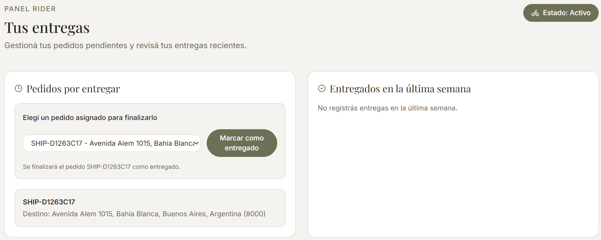
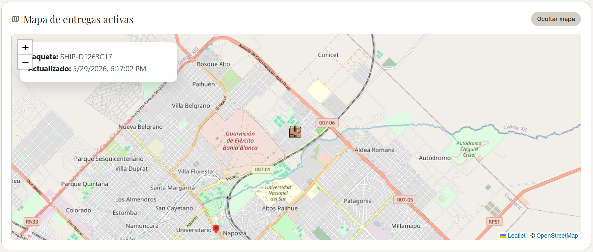

# Repartidor

Un repartidor puede loguearse como activo o inactivo y ver los paquetes que tiene a cargo.
Si está con un paquete vinculado que aún no entregó, puede acceder al seguimiento en tiempo real (y el usuario de compra puede hacer seguimiento) y marcarlo como entregado cuando corresponda.

---
### Seguimiento en tiempo real

El mapa de seguimiento real es opcional y está tercerizado a un servicio de autoría propia realizado para el proyecto. Marca con un pin el destino y con un paquete la posición actual del rider.