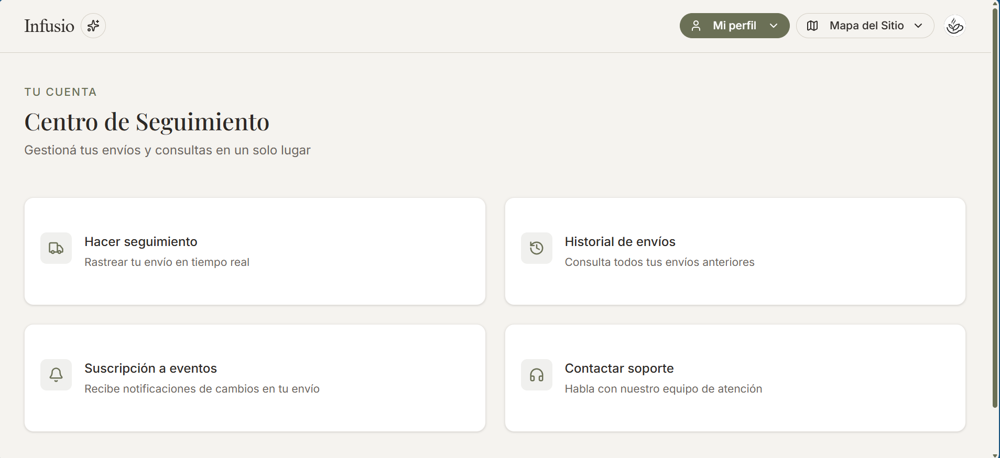
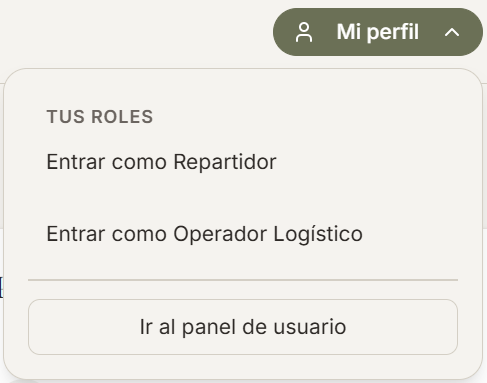
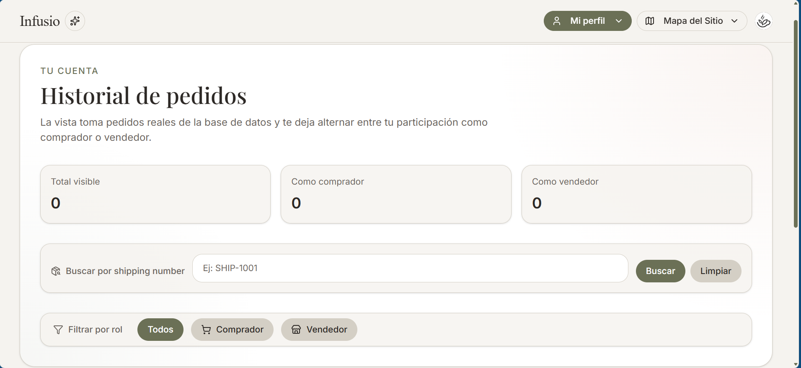

# Viewer

Vista general de `viewer`. Pueden acceder a un seguimiento de paquete, historial, suscribirse a notificaciones, contactar a soporte, crear y acceder a perfil de repartidor y/u operador logístico.

---
## Acceso a roles

---
## Seguimiento

Coincide con la vista del seguimiento al que tienen acceso los usuarios sin autenticar.

## Historial

Permite hacer seguimiento de estado de los pedidos previos y actuales del usuario. 
Opciones de filtrado:
- Por número de paquete
- Por rol en el envío (buyer o seller)

Ofrece paginación.

## Suscripción a eventos

Ofrece una vista con botones que permite elegir un tipo de suscripción a los cambios de los paquetes asociados al usuario: notificaciones push o vía email.

## Soporte

Coincide con la vista de contacto con soporte al que tienen acceso los usuarios sin autenticar.